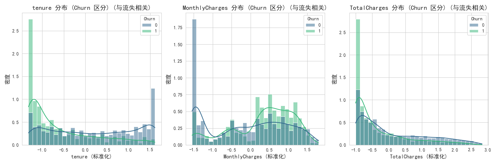
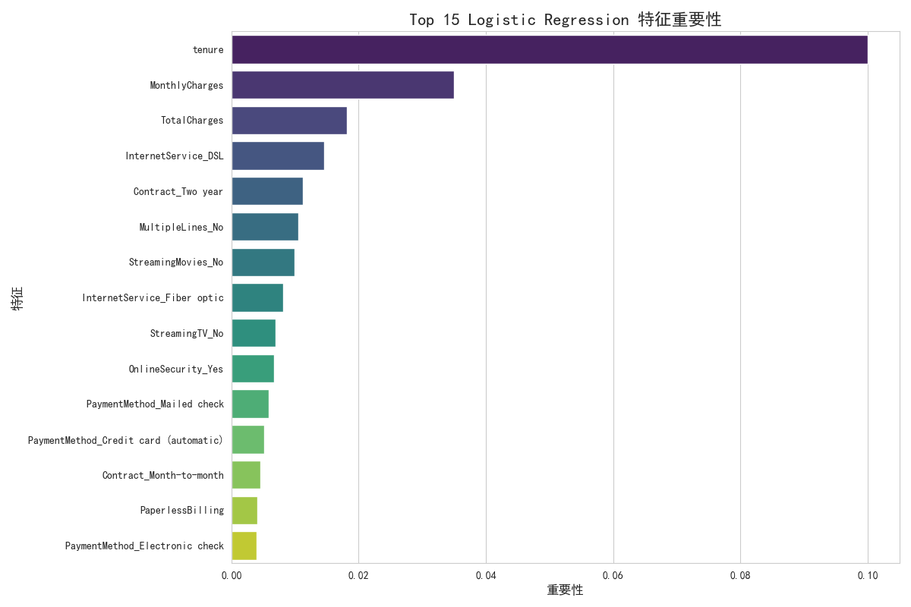

# 电信客户流失数据分析及可视化报告

## 1. 项目概述
本项目旨在对电信客户流失数据进行深入分析，识别流失客户的特征，预测流失趋势，并可视化呈现分析结果，以帮助电信公司制定有效的客户保留策略。

## 2. 数据集描述与预处理
数据集包含 7043 条客户记录和 41 个特征 (预处理后)。
主要处理步骤包括：缺失值填充 (TotalCharges)、客户ID删除、二元特征标签编码、多元分类特征独热编码、数值特征标准化。

## 3. 探索性数据分析 (EDA) 关键发现
通过EDA，我们发现：
- 目标变量 'Churn' (客户流失) 存在类别不平衡现象：不流失客户占 73.46%，流失客户占 26.54%。
- **流失风险最高的客户特征：**
    - **合同类型：** 按月付费 (Month-to-month) 合同的客户流失率远高于一年或两年合同的客户。
    - **服务类型：** 未订阅在线安全、技术支持服务，以及使用光纤互联网服务的客户流失率较高。
    - **支付方式：** 使用电子支票 (Electronic check) 支付的客户流失率较高。
    - **客户时长 (Tenure)：** 新客户（Tenure较短）的流失率显著更高。
    - **月费用 (MonthlyCharges)：** 月费用较高的客户流失率可能也更高。

## 4. 机器学习模型构建与评估
我们训练并评估了多种分类模型，并对比了它们在流失预测上的性能。为解决类别不平衡问题，部分模型使用了SMOTE过采样技术。

### 模型性能概览
|                           | accuracy   | precision   | recall   | f1_score   | ROC_AUC   |
|:--------------------------|:-----------|:------------|:---------|:-----------|:----------|
| Logistic Regression       | 0.805536   | 0.657233    | 0.558824 | 0.604046   | 0.841975  |
| Gradient Boosting (SMOTE) | 0.775018   | 0.563193    | 0.679144 | 0.615758   | 0.840487  |
| Random Forest (SMOTE)     | 0.772179   | 0.556025    | 0.703209 | 0.621015   | 0.837814  |
| Random Forest (No SMOTE)  | 0.797729   | 0.647841    | 0.52139  | 0.577778   | 0.837321  |

基于 ROC AUC Score，最佳模型为：**Logistic Regression**，其 ROC AUC 值为 **0.8420**。

### 最佳模型 (Logistic Regression) 详细评估
- 准确率 (Accuracy): 0.8055
- 精确率 (Precision): 0.6572
- 召回率 (Recall): 0.5588
- F1-Score: 0.6040
- ROC AUC Score: 0.8420

## 5. 流失原因分析 (特征重要性)
通过特征重要性分析 (主要采用Permutation Importance)，我们识别出对客户流失预测影响最大的特征：
|    | Feature                     | Importance   |
|:---|:----------------------------|:-------------|
| 0  | tenure                      | 0.1          |
| 1  | MonthlyCharges              | 0.0349894    |
| 2  | TotalCharges                | 0.0180979    |
| 3  | InternetService_DSL         | 0.0145493    |
| 4  | Contract_Two year           | 0.0112136    |
| 5  | MultipleLines_No            | 0.0105749    |
| 6  | StreamingMovies_No          | 0.00993612   |
| 7  | InternetService_Fiber optic | 0.00816182   |
| 8  | StreamingTV_No              | 0.00688432   |
| 9  | OnlineSecurity_Yes          | 0.00674237   |

这些重要特征再次验证了EDA中的发现，即合同类型、服务附加项和支付方式是影响客户流失的关键因素。

## 6. 结论与建议
基于以上分析，我们得出以下结论和客户保留建议：
1.  **关注按月合同客户：** 这类客户流失风险最高。可考虑为他们提供长期合同优惠或捆绑服务，增加合同的粘性。
2.  **提升增值服务订阅率：** 鼓励客户订阅在线安全和技术支持服务，这些服务能显著降低流失率。
3.  **优化光纤互联网和电子支票支付体验：** 尽管这些服务可能具有吸引力，但它们的用户流失率较高。需要深入研究这些服务中是否存在痛点或竞争劣势。这可能包括改进服务质量、提供更稳定的连接或更便捷的支付流程。
4.  **重视新客户维系：** 在客户入网初期提供更好的引导、专属服务或新客优惠，建立早期忠诚度。
5.  **实施差异化营销：** 根据客户的特征（如合同、服务类型、月费用等），对不同流失风险的客户群体采取定制化的挽留策略。

## 7. 未来工作
1.  **更复杂的模型：** 尝试XGBoost、LightGBM等更强大的Boosting模型，或深度学习模型。
2.  **高级特征工程：** 探索创建更多交互特征或多项式特征。
3.  **时间序列分析：** 如果有客户行为的时间序列数据，可以进行更精细的流失趋势预测和动态风险评估。
4.  **A/B 测试：** 将模型预测结果应用于实际营销活动，并进行A/B测试验证挽留策略的有效性。
5.  **交互式仪表板：** 使用Streamlit或Dash构建交互式应用，方便业务用户探索数据和预测结果。
