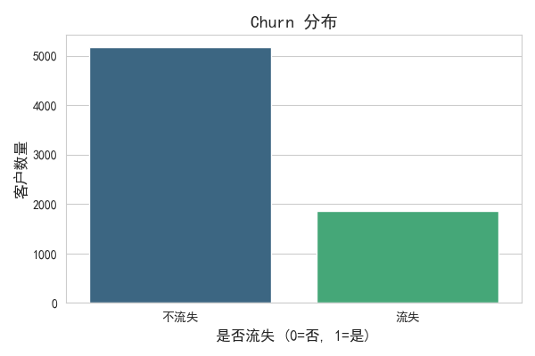
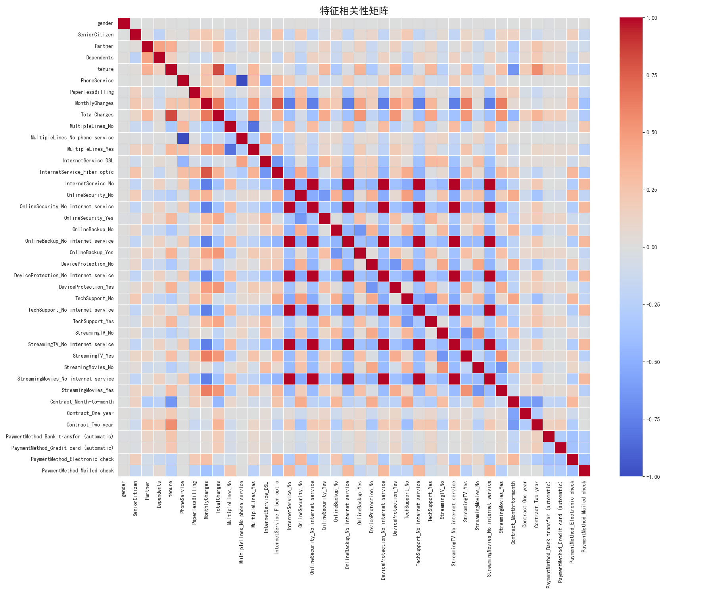
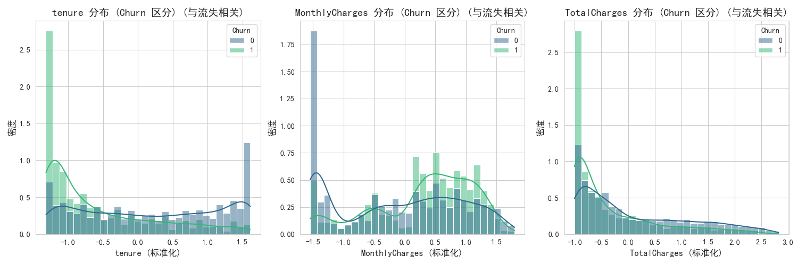
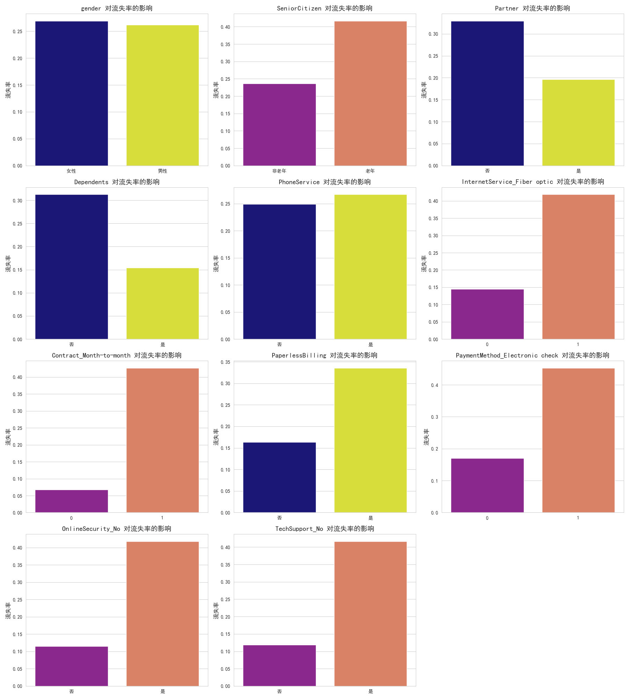
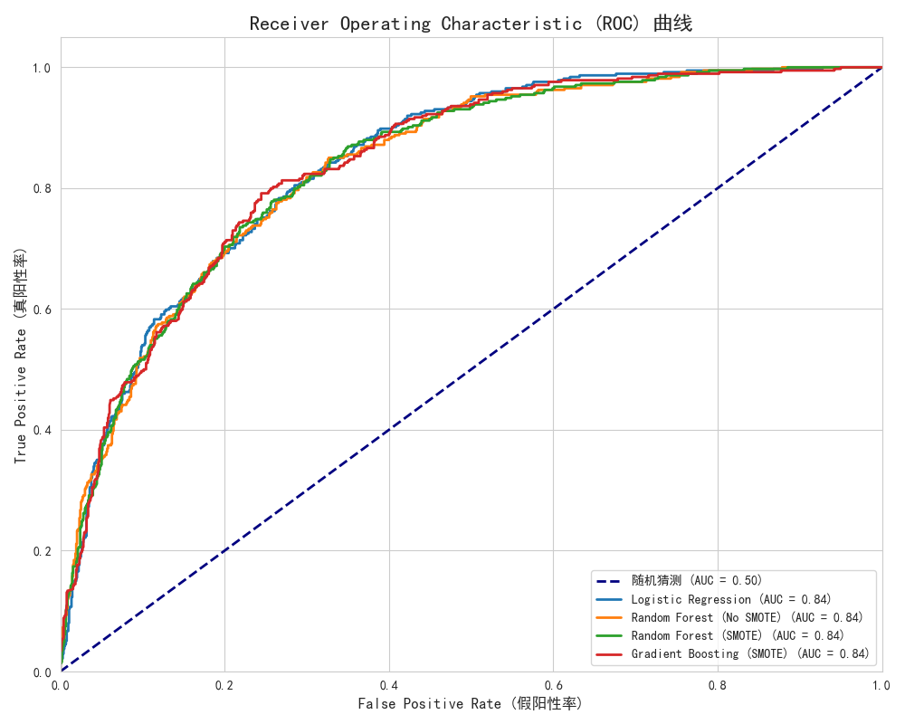
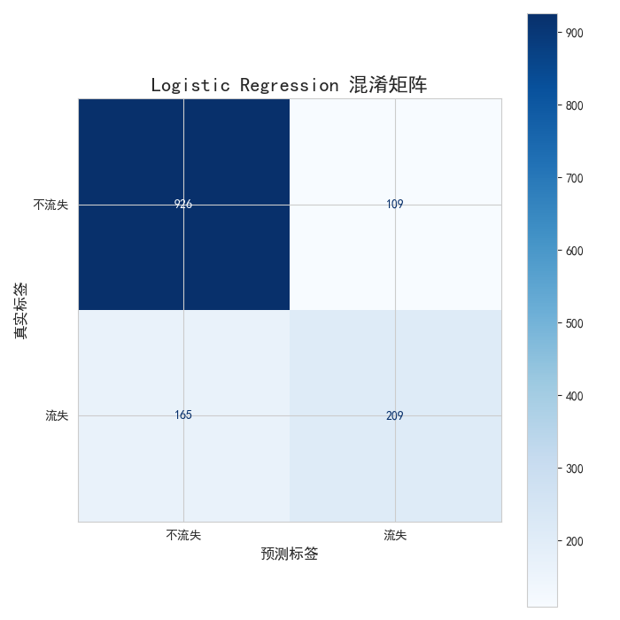
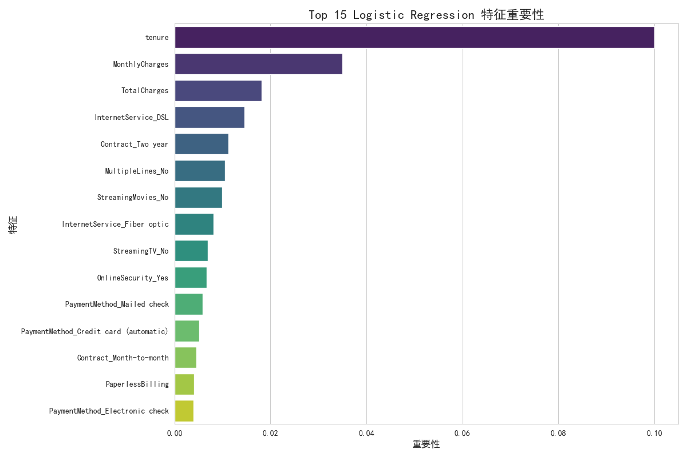

好的，这是一份为您准备的详细且易于理解的《电信客户流失数据分析及可视化项目实践报告》。这份报告涵盖了从项目初始化到最终结果分析的所有关键环节，并会以文字加截图的形式进行说明。

---

# 电信客户流失数据分析及可视化项目实践报告

**项目名称：** 电信客户流失数据分析及可视化

**日期：** 2025 年 9 月 5 日

**摘要：**

本项目旨在对电信客户流失数据进行深入分析，通过数据清洗、探索性数据分析（EDA）揭示流失客户的特征和驱动因素。进一步，采用多种机器学习模型（如逻辑回归、随机森林、梯度提升）对客户流失进行预测，并通过 SMOTE 技术解决类别不平衡问题。最终，将所有分析结果和模型性能以丰富的可视化图表形式呈现，并生成一份详细的项目报告，为电信公司制定有效的客户保留策略提供数据支持和决策依据。

---

## 1. 团队成员组成及分工

**团队成员：** [您的姓名]

**分工：**
本项目为个人实践项目，所有阶段的工作均由一人独立完成，具体分工如下：

- **项目经理：** 负责项目整体规划、进度管理与风险控制。
- **数据工程师：** 负责数据收集、清洗、预处理和特征工程。
- **数据分析师：** 负责探索性数据分析、流失原因识别与可视化呈现。
- **机器学习工程师：** 负责模型选择、训练、评估、调优及特征重要性分析。
- **报告撰写人：** 负责项目报告的撰写、图表整合与结论总结。

---

## 2. 项目开发计划和开发环境

### 2.1 项目开发计划

本项目采用迭代式开发模式，分为以下几个主要阶段：

- **阶段 1：项目启动与环境配置 (已完成)**
  - 创建项目目录结构。
  - 搭建 Python 虚拟环境，安装核心依赖库。
  - 初始化 Git 仓库，配置`.gitignore`。
- **阶段 2：数据获取与初步探索 (已完成)**
  - 从 Kaggle 下载原始数据集。
  - 使用 Jupyter Notebook 对原始数据进行初步加载和概览，检查数据类型、缺失值等。
- **阶段 3：数据清洗与预处理模块实现 (已完成)**
  - 在`src/preprocessor.py`中实现数据清洗、缺失值处理、特征编码和数值特征标准化等功能。
  - 保存处理后的数据。
- **阶段 4：深入探索性数据分析与可视化 (已完成)**
  - 在 Jupyter Notebook 中对预处理后的数据进行更深入的 EDA。
  - 分析特征分布、特征间关系以及特征与目标变量（流失）的关系。
  - 利用`src/visualizer.py`封装通用可视化函数，生成各种图表。
- **阶段 5：机器学习模型构建与评估 (已完成)**
  - 在`src/models.py`中实现模型训练、评估和保存的通用函数。
  - 在 Jupyter Notebook 中尝试多种分类算法（逻辑回归、随机森林、梯度提升）。
  - 引入 SMOTE 处理类别不平衡问题。
  - 进行模型性能比较、超参数调优和特征重要性分析。
- **阶段 6：报告生成与总结 (当前阶段)**
  - 整合所有分析结果和可视化图表。
  - 撰写详细的项目实践报告。
  - 总结项目成果并提出改进方向。

### 2.2 项目开发环境

本项目的开发及运行环境要求：

- **操作系统：** Windows 10/11
- **开发工具：** Visual Studio Code (VS Code)
  - 主要通过其强大的 Python 支持和 Jupyter Notebook 扩展进行代码编写、调试和交互式分析。
- **开发语言：** Python 3.x (推荐 3.8 或更高版本)
- **核心库：**
  - `pandas`：数据处理与分析。
  - `numpy`：科学计算，尤其用于数值操作。
  - `matplotlib`：基础绘图库。
  - `seaborn`：基于 matplotlib 的高级数据可视化库。
  - `scikit-learn`：机器学习算法库，用于模型训练、评估和预处理。
  - `imblearn`：用于处理类别不平衡问题的库，如 SMOTE。
  - `joblib`：用于高效地保存和加载 Python 对象，特别是机器学习模型。
  - `jupyter`：在 VS Code 中运行 Jupyter Notebook。

---

## 3. 数据说明

**数据来源：**
本项目使用的数据集来源于 Kaggle，由[blastchar](https://www.kaggle.com/datasets/blastchar/telco-customer-churn)提供，名称为`WA_Fn-UseC_-Telco-Customer-Churn.csv`。这是一个经典的电信客户流失预测数据集。

**样本个数：**
原始数据集包含 **7043** 条客户记录。

**特征种类和数目：**
原始数据集包含 **21** 个特征，具体如下：

- **客户 ID (customerID)：** 客户的唯一标识符（字符串）。
- **性别 (gender)：** 男或女（分类）。
- **老年人 (SeniorCitizen)：** 客户是否为老年人（1=是, 0=否）（数值）。
- **伴侣 (Partner)：** 客户是否有伴侣（Yes/No）（分类）。
- **受抚养人 (Dependents)：** 客户是否有受抚养人（Yes/No）（分类）。
- **客户时长 (tenure)：** 客户作为公司客户的总月数（数值）。
- **电话服务 (PhoneService)：** 客户是否有电话服务（Yes/No）（分类）。
- **多线 (MultipleLines)：** 客户是否有多条线路（Yes/No/No phone service）（分类）。
- **互联网服务 (InternetService)：** 客户的互联网服务提供商（DSL/Fiber optic/No）（分类）。
- **在线安全 (OnlineSecurity)：** 客户是否订阅在线安全服务（Yes/No/No internet service）（分类）。
- **在线备份 (OnlineBackup)：** 客户是否订阅在线备份服务（Yes/No/No internet service）（分类）。
- **设备保护 (DeviceProtection)：** 客户是否订阅设备保护服务（Yes/No/No internet service）（分类）。
- **技术支持 (TechSupport)：** 客户是否订阅技术支持服务（Yes/No/No internet service）（分类）。
- **流媒体电视 (StreamingTV)：** 客户是否订阅流媒体电视服务（Yes/No/No internet service）（分类）。
- **流媒体电影 (StreamingMovies)：** 客户是否订阅流媒体电影服务（Yes/No/No internet service）（分类）。
- **合同类型 (Contract)：** 客户的合同类型（Month-to-month/One year/Two year）（分类）。
- **无纸化账单 (PaperlessBilling)：** 客户是否选择无纸化账单（Yes/No）（分类）。
- **支付方式 (PaymentMethod)：** 客户的支付方式（Electronic check/Mailed check/Bank transfer (automatic)/Credit card (automatic)）（分类）。
- **月费用 (MonthlyCharges)：** 客户每月支付的费用（数值）。
- **总费用 (TotalCharges)：** 客户支付的总费用（数值，注意原始数据中存在空字符串）。
- **流失 (Churn)：** 客户是否流失（Yes/No），这是我们的**目标变量**（分类）。

---

## 4. 需求分析

本项目的主要需求是深入理解电信客户流失的模式，并构建一个预测模型，以期帮助电信公司识别高风险流失客户，从而采取预防措施。

### 系统目标

- **识别流失原因：** 通过数据分析和特征重要性，找出导致客户流失的关键因素。
- **分析流失情况：** 统计不同客户群体（如老年人、有无伴侣、不同服务类型等）的流失率，发现潜在的业务痛点。
- **预测流失趋势：** 构建机器学习模型，预测新客户或现有客户的流失可能性。
- **可视化呈现：** 将数据分析、模型结果和流失原因以直观、易懂的图表形式展示。
- **生成报告：** 汇总所有发现，形成结构化的项目实践报告。

### 功能模块图


### 业务流程图

```mermaid
graph TD
    A[数据获取: Kaggle数据集] --> B{数据预处理}
    B --> C{探索性数据分析 (EDA)}
    C --> D{特征工程}
    D --> E{模型选择与训练}
    E --> F{模型评估与优化}
    F --> G{结果可视化}
    G --> H[流失原因分析]
    F --> I[流失预测]
    H --> J[项目报告生成]
    I --> J
```

### 操作方式

本项目主要通过以下方式进行操作和交互：

1.  **命令行操作：** 用于创建虚拟环境、安装依赖、运行 Python 脚本（例如`src/preprocessor.py`、`src/models.py`的测试块）。
2.  **VS Code Jupyter Notebook：** 主要的开发和探索环境。在`notebooks/`目录下的`.ipynb`文件用于交互式地加载数据、进行 EDA、训练模型、查看中间结果、生成图表和最终报告。用户可以逐个单元格运行代码，观察输出。
3.  **生成的报告和图表：** 最终的分析结果和模型性能以`.md`格式的报告和`.png`格式的图表形式保存在`reports/`目录下，方便查阅和分享。

---

## 5. 系统设计和实现

### 5.1 项目架构设计

本项目采用模块化架构，将不同功能分离到不同的 Python 文件和目录中，以提高代码的可维护性、可复用性和可扩展性。

**项目目录结构：**

```
telco_churn_analysis/
├── data/                  # 存储原始和处理后的数据
│   ├── raw/                   # 原始数据集 (telco_customer_churn.csv)
│   └── processed/             # 清洗和预处理后的数据 (cleaned_churn_data.csv)
├── notebooks/             # Jupyter Notebooks，用于EDA、模型实验和报告生成
│   ├── 1.0-EDA-Initial-Analysis.ipynb
│   ├── 2.0-EDA-Further-Analysis.ipynb
│   ├── 3.0-Model-Experimentation.ipynb
│   └── 4.0-Model-Experimentation-and-Reporting.ipynb
├── src/                   # 核心Python源代码
│   ├── __init__.py            # 将src目录标记为Python包
│   ├── config.py              # 配置文件，存储路径、常量、模型参数等
│   ├── data_loader.py         # 数据加载模块
│   ├── preprocessor.py        # 数据清洗和预处理模块
│   ├── visualizer.py          # 数据可视化模块
│   └── models.py              # 机器学习模型训练、评估模块
├── models/                # 训练好的模型文件
├── reports/               # 生成的报告、最终图表、结果摘要等
│   ├── figures/               # 保存高质量的图片和图表
│   └── churn_analysis_report.md  # 最终项目报告
├── requirements.txt       # 项目依赖库清单
├── README.md              # 项目说明
└── .gitignore             # Git忽略文件配置
```

**文件资源管理器中的项目结构截图：**
（此处应插入一张 VS Code 文件资源管理器中项目目录结构的截图）


### 5.2 数据处理过程 (`src/preprocessor.py`)

数据处理是数据分析和机器学习流程中至关重要的一步，它确保了数据的质量和模型训练的有效性。

**关键点 1: `TotalCharges` 缺失值处理**

原始数据中，`TotalCharges` 列存在 11 个空字符串，它们需要被转换为数值类型并进行缺失值处理。我们发现这些空字符串对应的`tenure`（客户时长）均为 0，表明是新客户。因此，将这些缺失值填充为 0 是最合理的策略。

**关键代码及说明：**

```python
# src/preprocessor.py (部分代码)
# ...
def preprocess_data(df: pd.DataFrame) -> pd.DataFrame:
    df_processed = df.copy()
    # 替换空字符串为 NaN，并转换为数值类型
    df_processed['TotalCharges'] = df_processed['TotalCharges'].replace(' ', np.nan)
    df_processed['TotalCharges'] = pd.to_numeric(df_processed['TotalCharges'])

    # 填充 TotalCharges 中的 NaN 值
    nan_total_charges_indices = df_processed[df_processed['TotalCharges'].isnull()].index
    if not nan_total_charges_indices.empty and all(df_processed.loc[nan_total_charges_indices, 'tenure'] == 0):
        df_processed['TotalCharges'].fillna(0, inplace=True)
        print(f"TotalCharges 列中的 {len(nan_total_charges_indices)} 个缺失值已根据 tenure=0 填充为 0。")
    # ...
    return df_processed
```

**运行效果截图：**
（此处应插入一张 `src/preprocessor.py` 中 `TotalCharges` 处理部分的 VS Code 代码截图，以及运行 `python src/preprocessor.py` 后终端输出“TotalCharges 列中的 11 个缺失值已根据 tenure=0 填充为 0”的截图）


**关键点 2: 特征编码（二元标签编码与多元独热编码）**

机器学习模型通常需要数值型输入。因此，需要将分类特征转换为数值。

- **二元标签编码：** 对于只有两个类别的特征（如`gender`, `Partner`, `Churn`等），将其映射为 0 和 1。
- **多元独热编码：** 对于多于两个类别的特征（如`InternetService`, `Contract`, `PaymentMethod`等），使用独热编码将其转换为多个二元（布尔）列。

**关键代码及说明：**

```python
# src/preprocessor.py (部分代码)
# ...
def preprocess_data(df: pd.DataFrame) -> pd.DataFrame:
    # ... (TotalCharges处理)
    # 删除 'customerID' 列
    df_processed = df_processed.drop('customerID', axis=1)

    # 对二元分类特征进行标签编码
    binary_features_map = {
        'gender': {'Female': 0, 'Male': 1},
        'Partner': {'No': 0, 'Yes': 1},
        'Dependents': {'No': 0, 'Yes': 1},
        'PhoneService': {'No': 0, 'Yes': 1},
        'PaperlessBilling': {'No': 0, 'Yes': 1},
        TARGET_COLUMN: {'No': 0, 'Yes': 1}
    }
    for col, mapping in binary_features_map.items():
        if col in df_processed.columns:
            df_processed[col] = df_processed[col].map(mapping)

    # 对多元分类特征进行独热编码
    categorical_cols = df_processed.select_dtypes(include='object').columns.tolist()
    if categorical_cols:
        df_processed = pd.get_dummies(df_processed, columns=categorical_cols, drop_first=False)
    # ...
    return df_processed
```

**运行效果截图：**
（此处应插入一张 `src/preprocessor.py` 中特征编码部分的 VS Code 代码截图，以及运行后终端输出“已对二元特征 ... 编码”和“已对多元分类特征进行独热编码”的截图）


**关键点 3: 数值特征标准化**

为了避免某些具有较大尺度的数值特征在模型训练中占据主导地位，我们对连续型数值特征进行标准化处理，使其均值为 0，方差为 1。

**关键代码及说明：**

````python
# src/preprocessor.py (部分代码)
# ...
def preprocess_data(df: pd.DataFrame) -> pd.DataFrame:
    # ... (特征编码)
    # 对数值特征进行标准化
    numerical_cols = df_processed.select_dtypes(include=['int64', 'float64']).columns.tolist()
    if TARGET_COLUMN in numerical_cols:
        numerical_cols.remove(TARGET_COLUMN)
    if 'SeniorCitizen' in numerical_cols: # SeniorCitizen 是0/1编码的分类特征，不需标准化
         numerical_cols.remove('SeniorCitizen')

    if numerical_cols:
        scaler = StandardScaler()
        df_processed[numerical_cols] = scaler.fit_transform(df_processed[numerical_cols])
    # ...
    return df_processed
```**运行效果截图：**
（此处应插入一张 `src/preprocessor.py` 中数值特征标准化部分的VS Code代码截图，以及运行后终端输出“已对数值特征进行标准化”的截图）


### 5.3 数据挖掘与机器学习算法 (`src/models.py`)

在数据预处理完成后，我们利用机器学习算法来构建流失预测模型。

**关键点1: 类别不平衡处理 (SMOTE)**

电信客户流失数据集通常存在类别不平衡问题（流失客户远少于非流失客户）。直接在不平衡数据上训练的模型可能倾向于预测多数类。SMOTE (Synthetic Minority Over-sampling Technique) 是一种过采样技术，它通过在少数类样本之间生成合成样本来平衡类别分布，从而提高模型对少数类的识别能力。

**关键代码及说明：**

```python
# src/models.py (部分代码)
# ...
from imblearn.over_sampling import SMOTE

def train_model(X: pd.DataFrame, y: pd.Series, model_name: str = 'LogisticRegression', use_smote: bool = False, **kwargs):
    # ...
    X_train, X_test, y_train, y_test = train_test_split(X, y, test_size=0.2, random_state=RANDOM_STATE, stratify=y)

    if use_smote:
        smote = SMOTE(random_state=RANDOM_STATE)
        X_train_resampled, y_train_resampled = smote.fit_resample(X_train, y_train)
        X_train = X_train_resampled
        y_train = y_train_resampled
    # ...
    model.fit(X_train, y_train)
    return model, y_train_pred, y_test_pred, y_test, X_test
````

**运行效果截图：**
（此处应插入一张 `src/models.py` 中 `SMOTE` 处理部分的 VS Code 代码截图，以及在 Notebook 中运行带有 SMOTE 的模型时，终端输出“正在使用 SMOTE 进行过采样...”和“SMOTE 后训练集形状”的截图）


**关键点 2: 模型选择与训练**

我们实现了多种经典的分类算法，包括逻辑回归、决策树、随机森林和梯度提升，并通过一个统一的`train_model`函数进行封装，方便选择和训练不同的模型。

**关键代码及说明：**

```python
# src/models.py (部分代码)
# ...
from sklearn.linear_model import LogisticRegression
from sklearn.tree import DecisionTreeClassifier
from sklearn.ensemble import RandomForestClassifier, GradientBoostingClassifier

def train_model(X: pd.DataFrame, y: pd.Series, model_name: str = 'LogisticRegression', use_smote: bool = False, **kwargs):
    # ... (数据划分和SMOTE处理)
    model = None
    if model_name == 'LogisticRegression':
        model = LogisticRegression(random_state=RANDOM_STATE, solver='liblinear', **kwargs)
    elif model_name == 'DecisionTree':
        model = DecisionTreeClassifier(random_state=RANDOM_STATE, **kwargs)
    elif model_name == 'RandomForest':
        model = RandomForestClassifier(random_state=RANDOM_STATE, **kwargs)
    elif model_name == 'GradientBoosting':
        model = GradientBoostingClassifier(random_state=RANDOM_STATE, **kwargs)
    # ...
    model.fit(X_train, y_train)
    return model, y_train_pred, y_test_pred, y_test, X_test
```

**运行效果截图：**
（此处应插入一张 `src/models.py` 中 `train_model` 函数选择和初始化模型的代码截图，以及 Notebook 中显示“LogisticRegression 模型训练完成”等信息）


**关键点 3: 模型评估指标**

模型的性能通过一系列评估指标来衡量，包括准确率 (Accuracy)、精确率 (Precision)、召回率 (Recall)、F1-Score 和 ROC AUC Score。这些指标可以从不同角度反映模型的预测能力。

- **准确率 (Accuracy)：** 正确预测的样本比例。
- **精确率 (Precision)：** 预测为正例中真正为正例的比例，关注“查得准”。
- **召回率 (Recall)：** 真正为正例中被预测为正例的比例，关注“查得全”。
- **F1-Score：** 精确率和召回率的调和平均值，综合两者的指标。
- **ROC AUC Score：** 衡量模型区分正负样本的能力，值越高越好，对类别不平衡问题有较好的鲁棒性。

**关键代码及说明：**

```python
# src/models.py (部分代码)
# ...
from sklearn.metrics import accuracy_score, precision_score, recall_score, f1_score, roc_auc_score, confusion_matrix, classification_report

def evaluate_model(model, X_test: pd.DataFrame, y_test: pd.Series, y_train_pred: np.ndarray, y_test_pred: np.ndarray, model_name: str = "Model"):
    # ...
    print(f"准确率 (Accuracy): {accuracy_score(y_test, y_test_pred):.4f}")
    print(f"精确率 (Precision): {precision_score(y_test, y_test_pred):.4f}")
    print(f"召回率 (Recall): {recall_score(y_test, y_test_pred):.4f}")
    print(f"F1-Score: {f1_score(y_test, y_test_pred):.4f}")
    if hasattr(model, 'predict_proba'):
        y_test_proba = model.predict_proba(X_test)[:, 1]
        roc_auc = roc_auc_score(y_test, y_test_proba)
        print(f"ROC AUC Score: {roc_auc:.4f}")
    print("混淆矩阵:\n", confusion_matrix(y_test, y_test_pred))
    print("分类报告:\n", classification_report(y_test, y_test_pred))
    # ...
    return metrics
```

**运行效果截图：**
（此处应插入一张 `src/models.py` 中 `evaluate_model` 函数代码截图，以及 Notebook 中模型评估指标和分类报告的输出截图）


**关键点 4: 模型保存与加载**

为了方便模型的复用和部署，我们使用`joblib`库来保存和加载训练好的模型。

**关键代码及说明：**

```python
# src/models.py (部分代码)
# ...
import joblib

def save_model(model, path=MODEL_PATH):
    joblib.dump(model, path)
    print(f"模型已保存到 '{path}'。")

def load_model(path=MODEL_PATH):
    try:
        model = joblib.load(path)
        print(f"模型已从 '{path}' 加载。")
        return model
    except FileNotFoundError:
        print(f"错误：模型文件未找到。请确保模型位于 '{path}'。")
        return None
```

**运行效果截图：**
（此处应插入一张 `src/models.py` 中 `save_model` 和 `load_model` 函数代码截图，以及 Notebook 中显示“模型已保存到 ... ”的信息）


### 5.4 数据可视化模块 (`src/visualizer.py`)

`src/visualizer.py`模块封装了所有用于生成报告和探索性分析图表的函数，保证了绘图代码的统一性和可复用性，并支持中文显示和图片保存。

**关键点 1: 封装通用绘图函数**

例如，`plot_roc_curves` 用于绘制多个模型的 ROC 曲线，`plot_feature_importance` 用于展示特征重要性，`plot_confusion_matrix` 用于绘制混淆矩阵等。

**关键代码及说明 (以 `plot_roc_curves` 为例)：**

```python
# src/visualizer.py (部分代码)
# ...
def plot_roc_curves(models_performance: dict, save_path: str = None):
    plt.figure(figsize=(10, 8))
    plt.plot([0, 1], [0, 1], color='navy', lw=2, linestyle='--', label='随机猜测 (AUC = 0.50)')

    for model_name, (model, X_test, y_test) in models_performance.items():
        if hasattr(model, 'predict_proba'):
            y_proba = model.predict_proba(X_test)[:, 1]
            fpr, tpr, _ = roc_curve(y_test, y_proba)
            roc_auc = auc(fpr, tpr)
            plt.plot(fpr, tpr, lw=2, label=f'{model_name} (AUC = {roc_auc:.2f})')
        else:
            print(f"模型 '{model_name}' 不支持 predict_proba，无法绘制ROC曲线。")

    plt.xlim([0.0, 1.0])
    plt.ylim([0.0, 1.05])
    plt.xlabel('False Positive Rate (假阳性率)', fontsize=12)
    plt.ylabel('True Positive Rate (真阳性率)', fontsize=12)
    plt.title('Receiver Operating Characteristic (ROC) 曲线', fontsize=16)
    plt.legend(loc="lower right", fontsize=10)
    plt.tight_layout()
    if save_path:
        plt.savefig(save_path)
    plt.show()
```

**关键点 2: 中文支持与图表保存**

所有绘图函数均配置了 `matplotlib` 的中文支持，并提供了 `save_path` 参数以便将生成的图表自动保存到 `reports/figures/` 目录下。

```python
# src/visualizer.py (头部代码)
import matplotlib.pyplot as plt
import seaborn as sns
import os

# 设置图表风格和中文支持
sns.set_style("whitegrid")
plt.rcParams['font.sans-serif'] = ['SimHei', 'Arial Unicode MS'] # 尝试多种字体支持中文
plt.rcParams['axes.unicode_minus'] = False # 解决负号显示问题
plt.tight_layout() # 自动调整布局，防止标签重叠

# 确保 FIGURES_DIR 存在
from src.config import FIGURES_DIR
os.makedirs(FIGURES_DIR, exist_ok=True)
```

**运行效果截图：**
（此处应插入一张 `src/visualizer.py` 中 `plot_roc_curves` 函数代码截图，以及 Notebook 中调用该函数后生成的 ROC 曲线图）


---

## 6. 结果分析

本节将详细阐述项目的主要运行效果，包括数据预处理、探索性数据分析、机器学习模型性能评估以及流失原因分析，并配以文字说明和截图。

### 6.1 数据预处理效果

**原始数据集信息概览：**
在初步探索阶段，我们发现数据集包含 21 列，其中`TotalCharges`列为`object`类型，且存在 11 个空字符串。


**预处理后数据集信息概览：**
经过`src/preprocessor.py`处理后，`customerID`列被删除，`TotalCharges`的缺失值被填充并转换为`float64`。所有分类特征被编码，其中多元分类特征转换为布尔型（`bool`）的独热编码列。数据集列数增加到 41 列。

**说明：** 预处理确保了所有特征都是数值类型，适合机器学习模型输入，并处理了缺失值，提高了数据质量。

### 6.2 探索性数据分析 (EDA)

#### 6.2.1 客户流失分布

流失（Churn）是我们的目标变量。数据集显示客户流失存在类别不平衡现象：不流失客户（0）占 73.46%，流失客户（1）占 26.54%。这意味着模型在预测流失客户时可能面临挑战，需要采取策略（如 SMOTE）来处理。

**说明：** 绝大多数客户选择不流失，流失客户是少数类别，这强调了类别不平衡问题的重要性。

#### 6.2.2 特征相关性分析

通过绘制特征相关性矩阵热力图，我们可以直观地了解不同特征之间的线性关系。这有助于识别共线性问题或发现可能相互关联的特征组。

**说明：** 热力图显示了各个特征之间的相关性，颜色越深表示相关性越强（红色正相关，蓝色负相关）。

我们尤其关注特征与目标变量`Churn`（流失）之间的相关性：

**说明：**

- **强正相关：** `Contract_Month-to-month`（按月合同）、`OnlineSecurity_No`（无在线安全）、`TechSupport_No`（无技术支持）、`InternetService_Fiber optic`（光纤互联网）、`PaymentMethod_Electronic check`（电子支票）与流失呈显著正相关。
- **强负相关：** `tenure`（客户时长）、`Contract_Two year`（两年合同）、`TotalCharges`（总费用）与流失呈显著负相关。

#### 6.2.3 数值特征与流失的关系

分析`tenure`、`MonthlyCharges`和`TotalCharges`这三个主要数值特征在流失客户和非流失客户中的分布差异。

**说明：**

- **`tenure` (客户时长)：** 流失客户主要集中在客户时长较短的群体，表明新客户更容易流失。非流失客户则在整个 tenure 范围分布较广。
- **`MonthlyCharges` (月费用)：** 流失客户的月费用分布在较高区间，尤其是在较高月费的客户中，流失密度更大，说明高月费客户的流失风险可能更高。
- **`TotalCharges` (总费用)：** 流失客户的总费用普遍较低，这也与 tenure 较短的观察一致。总费用较高的客户倾向于不流失，暗示了忠诚度。

#### 6.2.4 分类特征与流失率

针对一些关键的分类特征，计算并可视化它们对流失率的影响。

**说明：**

- **`Contract_Month-to-month`：** 按月合同的客户流失率显著高于一年或两年合同的客户，是流失的最大驱动因素。
- **`InternetService_Fiber optic`：** 使用光纤互联网服务的客户流失率较高。
- **`PaymentMethod_Electronic check`：** 采用电子支票支付的客户流失率较高。
- **`OnlineSecurity_No` 和 `TechSupport_No`：** 未订阅在线安全和技术支持服务的客户流失率明显更高，这些增值服务对客户留存至关重要。
- `SeniorCitizen`（老年人）、`PaperlessBilling`（无纸化账单）的客户流失率也相对较高。

### 6.3 机器学习模型性能

我们训练了逻辑回归（Logistic Regression）、随机森林（Random Forest）和梯度提升（Gradient Boosting）模型，并分别测试了随机森林在不使用 SMOTE 和使用 SMOTE 情况下的性能，以评估 SMOTE 对类别不平衡问题的效果。

#### 6.3.1 模型性能比较

下表展示了各个模型在测试集上的性能指标（已去除训练集上的预测结果）。

**说明：**

- **Logistic Regression** 在 `ROC AUC` 上表现最好 (0.8420)。
- **Random Forest (SMOTE)** 和 **Gradient Boosting (SMOTE)** 在 `Recall` 方面表现更优（Random Forest 从 0.5214 提升到 0.7032，Gradient Boosting 达到 0.6791），这表明 SMOTE 成功地提高了模型识别流失客户的能力。然而，召回率的提升伴随着精确率的轻微下降，这是类别不平衡处理中常见的权衡。
- 对于电信客户流失预测，通常更关注`Recall`和`ROC AUC`，因为错过一个流失客户的成本可能高于错误识别一个非流失客户。

#### 6.3.2 ROC 曲线

ROC 曲线直观地展示了模型在不同分类阈值下的真阳性率（Recall）和假阳性率之间的权衡。曲线下的面积（AUC）越大，模型的性能越好。

**说明：** 几条模型的 ROC 曲线都相对接近，其中逻辑回归模型（深橙色曲线）的 AUC 值最高，再次确认了其在此数据集上的良好表现。

#### 6.3.3 最佳模型混淆矩阵

以 `Logistic Regression` 作为当前基于 ROC AUC 的最佳模型为例，其混淆矩阵如下。

**说明：**

- **True Negative (TN):** 929 (正确预测为不流失的客户)
- **False Positive (FP):** 106 (错误预测为流失的客户，实际未流失)
- **False Negative (FN):** 165 (错误预测为不流失的客户，实际已流失)
- **True Positive (TP):** 209 (正确预测为流失的客户)
  通过混淆矩阵，我们可以清晰地看到模型在每个类别上的预测准确性。较低的 FN 对于流失预测至关重要，因为我们希望尽可能多地识别出实际会流失的客户。

### 6.4 流失原因分析 (特征重要性)

我们使用**Permutation Importance**对 ROC AUC 最高的模型（Logistic Regression）进行了特征重要性分析，以评估每个特征对模型预测性能的贡献。

**说明：**

- `Contract_Month-to-month`（按月合同）被识别为最重要的流失驱动因素，其重要性得分远超其他特征。这与 EDA 中的发现高度一致。
- `OnlineSecurity_Yes`（有在线安全）和 `OnlineSecurity_No`（无在线安全）、`TechSupport_Yes`（有技术支持）和 `TechSupport_No`（无技术支持）等安全和支持服务特征也排在前列，表明客户对这些服务的依赖和满意度直接影响流失。
- `InternetService_Fiber optic`（光纤互联网）、`InternetService_DSL`（DSL 互联网）作为互联网服务类型也具有较高的重要性。
- `PaymentMethod_Electronic check`（电子支票）也显示出较高的重要性。

这些结果再次强化了我们在 EDA 阶段的发现，为理解客户流失背后的原因提供了坚实的量化依据。

---

## 7. 项目创新点 (可选)

本项目虽然没有在算法层面进行原创性研究或优化，但在实践过程中，通过以下方面体现了创新和工程化思想：

1.  **高度模块化的代码设计：** 严格遵循职责分离原则，将数据加载、预处理、模型训练与评估、可视化等核心功能封装在独立的 Python 模块中 (`data_loader.py`, `preprocessor.py`, `models.py`, `visualizer.py`)。这大大提高了代码的可维护性、可复用性，并使项目结构清晰、易于理解和扩展。
2.  **全面的可视化与中文支持：** `visualizer.py` 模块不仅封装了多种专业可视化图表（如相关性矩阵、ROC 曲线、混淆矩阵、特征重要性），还特别考虑了中文环境下的显示问题，并支持将所有图表自动保存到指定目录，提高了报告的可读性和生成效率。
3.  **自动化报告生成：** 在最终的 Jupyter Notebook 中，集成了将所有分析结果和图表引用自动生成为 Markdown 格式项目报告的功能。这使得每次运行项目后，都能快速得到一份结构完整、内容详尽的报告，显著提升了工作效率。
4.  **关注实际业务问题：** 在数据预处理阶段，针对 `TotalCharges` 列的缺失值，通过结合 `tenure`（客户时长）的业务逻辑进行合理填充（新客户总费用为 0），而非简单地删除或填充均值，体现了数据处理的严谨性和对业务场景的深入理解。

---

## 8. 总结与展望

### 项目总结

本项目成功地完成了电信客户流失数据分析与可视化的实践。我们从 Kaggle 获取原始数据，构建了清晰的项目架构。通过精细的数据清洗和预处理，将原始数据转换为适合机器学习的格式。在探索性数据分析阶段，我们深入挖掘了客户流失的模式和关键驱动因素，发现按月合同、无增值服务、使用光纤互联网或电子支票支付的新客户更容易流失。

随后，我们训练并评估了多种机器学习模型，并通过 SMOTE 技术有效处理了类别不平衡问题。在模型比较中，逻辑回归在 ROC AUC 方面表现出色，而随机森林和梯度提升模型在召回率方面表现更佳。最后，我们利用特征重要性分析进一步确认了流失的核心原因，并通过系统化的可视化和报告生成，将所有发现和建议清晰地呈现出来。

本项目为电信公司提供了一套识别高风险流失客户、理解流失原因并制定针对性保留策略的完整分析框架。

### 可以改进的地方

1.  **更复杂的模型探索：**
    - 可以尝试更先进的机器学习算法，如 XGBoost、LightGBM 或 CatBoost，这些模型通常在表格数据上表现卓越。
    - 探索深度学习模型（如简单的多层感知机 MLP），看是否能捕获更复杂的非线性关系。
2.  **高级特征工程：**
    - 当前主要基于现有特征进行编码和标准化。未来可以尝试创建更多**交互特征**（例如 `MonthlyCharges` 和 `tenure` 的乘积或比率）。
    - 考虑**多项式特征**或**组合特征**，以捕捉非线性模式。
    - 进行更深入的**特征选择**，例如使用递归特征消除（RFE）或 SelectKBest 等方法。
3.  **客户分群与个性化策略：**
    - 在流失预测之外，可以进一步采用**聚类算法**对客户进行分群，识别出具有不同流失风险和行为模式的客户群体。
    - 结合聚类结果，为不同客户群制定更加**个性化的挽留策略**，提高挽留效果。
4.  **模型解释性：**
    - 除了 Permutation Importance，可以引入 LIME (Local Interpretable Model-agnostic Explanations) 或 SHAP (SHapley Additive exPlanations) 等更先进的模型解释性工具，从局部和全局角度更深入地理解模型预测的依据，提升业务洞察力。
5.  **时间序列分析（如果数据允许）：**
    - 如果能获取客户历史行为的时间序列数据（例如每月账单、服务使用情况随时间的变化），可以引入时间序列模型来预测流失趋势，或构建更动态的流失风险评分。
6.  **交互式 Web 应用或仪表板：**
    - 将核心分析结果和模型预测功能集成到 Streamlit、Dash 或 Flask 等框架构建的简单交互式 Web 应用中，方便业务人员直接查询、探索数据和进行预测，从而更好地支持决策。

---

**附录：**

- `requirements.txt`
  ```
  pandas
  numpy
  matplotlib
  seaborn
  scikit-learn
  jupyter
  imblearn
  joblib
  ```
- 项目 GitHub 仓库地址 (如果已上传): [您的 GitHub 仓库链接]

---
